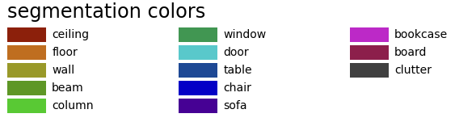

# Point Cloud Segmentation(real, indoor data)

* This is a result of direct application on real, indoor data with JSIS3D(CVPR 2019) as a PointNet-based model. 
* results of another model, as a voxelization & sparse-convolution based model, will be added later.

> **JSIS3D: Joint Semantic-Instance Segmentation of 3D Point Clouds with** 
> **Multi-Task Pointwise Networks and Multi-Value Conditional Random Fields** 
> Quang-Hieu Pham, Duc Thanh Nguyen, Binh-Son Hua, Gemma Roig, Sai-Kit
> Yeung  *Conference on Computer Vision and Pattern Recognition (CVPR),
> 2019* (**Oral**) 
> [Paper](https://arxiv.org/abs/1904.00699) |
> [Homepage](https://pqhieu.github.io/research/cvpr19/) |
> [Github](https://github.com/pqhieu/jsis3d)

## Usage

### Prerequisites
This code is tested in Manjaro Linux with CUDA 10.0 and Pytorch 1.0.

- Python 3.5+
- Pytorch 0.4.0+

### Installation
To use MV-CRF (optional), you first need to compile the code:

    cd external/densecrf
    mkdir build
    cd build
    cmake -D CMAKE_BUILD_TYPE=Release ..
    make
    cd ../../.. # You should be at the root folder here
    make

### Dataset
We have preprocessed the S3DIS dataset ([2.5GB](https://drive.google.com/open?id=1s1cFfb8cInM-SNHQoTGxN9BIyNpNQK6x))
in HDF5 format. After downloading the files, put them into the corresponding
`data/s3dis/h5` folder.

### Training & Evaluation
To train a model on S3DIS dataset:

    python train.py --config configs/s3dis.json --logdir logs/s3dis

Log files and network parameters will be saved to the `logs/s3dis` folder.

After training, we can use the model to predict semantic-instance segmentation
labels as follows:

    python pred.py --logdir logs/s3dis --mvcrf

To evaluate the results, run the following command:

    python eval.py --logdir logs/s3dis

For more details, you can use the `--help` option for every scripts.

### Prepare your own dataset
1. Add your .ply files in './data/s3dis/raw_data' directory.
2. process data with process_data.py in ./scripts. This will make numpy data with .ply files.  
`python process_data.py --root data/s3dis`
3. prepare .h5 files with prepare_h5.py in './scripts' This will make .h5 files in my_h5 folder.  
`python prepare_h5.py --root data/s3dis`
4. predict with the trained model and make the prediction file.
`python my_pred.py --logdir logs/my_s3dis`
5. visualize the results with main.py
`python main.py`

### Experiments on the real data

...updating
        

**Contact**: SeongJu Kang(djflstkddk@gmail.com)
